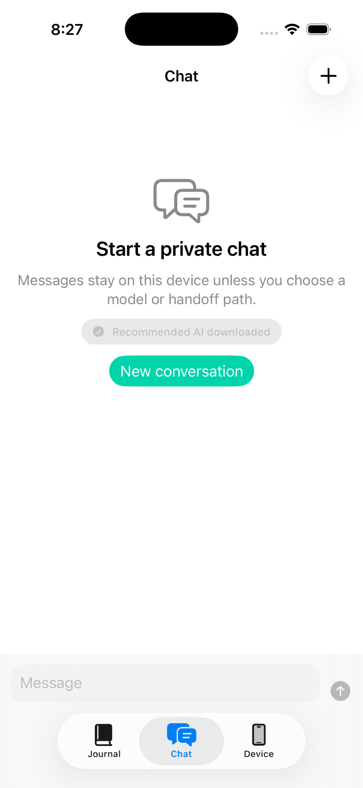
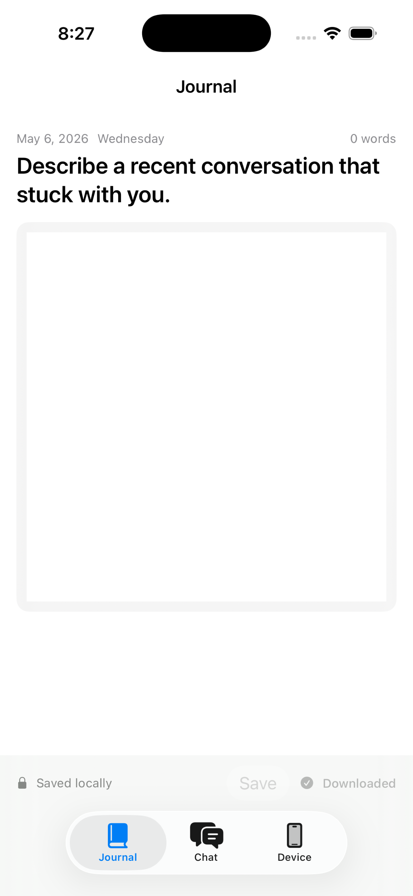
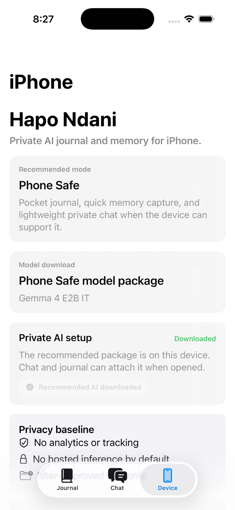

# Hapo Ndani

**A consent layer for personal data, with a local-AI client as its reference
implementation.**

A person grants scoped access to their own files. They see an offer — who wants
what, and what it pays. They decide, per offer, whether to send anything. The
money routes to *them*, not to a platform. Every local read is written to an
append-only ledger, including whether it ever left the device.

That sequence — **scope → offer → consent → payment → provenance** — is what
this repository specifies.

**Be exact about what is built.** Scope, consent and provenance are implemented
here, and they work with the machine offline. The paying half is a
specification with nothing behind it: there is no rail in this repository, no
payout has ever been made, and **no participant has ever been paid.** If you
are evaluating this, evaluate the design — there is no track record to weigh,
and any page that implies otherwise is wrong.

*Hapo ndani* is Swahili for "in there".

<p align="center">
  
  
  
</p>

---

## The primitive

Plenty of software runs a model on your laptop. What is missing is the part where
a person can **sell access to their own data on terms they can see**, and have
the proceeds reach them rather than a platform.

Four pieces make that work, and they are all here:

| | |
| --- | --- |
| **Scope** | Access is granted per folder and is revocable. On Apple platforms it uses security-scoped bookmarks, so a grant can go *stale* — and the app reports that rather than silently retrying. No scope, no read. |
| **Consent** | Granting folder access is **not** consent to sell. Submitting to an offer is a separate, explicit act, for one offer, carrying text the person wrote themselves. The client has no field for file contents — the invariant is structural, not a promise. |
| **Payment** | *Specified, not shipped.* The payout figure is defined as what the **person** receives, not a platform cut, and balance, earnings and withdrawal eligibility are defined as user-visible — but all of it renders from a rail, and no rail exists. Identity is an **Ed25519 keypair the client generates locally**: the rail issues nothing and learns nothing it was not handed. Payout is the deliberate exception, because getting paid requires KYC. |
| **Provenance** | Every read lands in an append-only ledger with a `wasSentOffDevice` flag and the *length* of what was read, never the content. That is what makes "it stayed local" auditable instead of a marketing line. |

The protocol is specified in **[docs/BACKEND_SEAM.md](docs/BACKEND_SEAM.md)** —
six endpoints, two invariants, the keypair identity scheme, and the local types they act against. It is
written so a third party can implement a rail against it.

## The reference client

The apps are a working local-AI workspace: chat, a journal, and a memory, with
the model loaded from a file on your own disk.

This matters for one reason — it proves the consent layer against a real
workload on real hardware rather than a toy. If no valid model is present the app
says so and refuses to chat; it will not quietly fall back to a hosted API,
because that would make the ledger a lie.

- **Local chat** against a GGUF or LiteRT-LM model you supply
- **Journal and memory** in a local store (Room on Android; app-owned storage on
  Apple platforms). Android backup is switched off so they are not swept into a
  cloud backup
- **The permission ledger and audit trail**, described above
- **Honest capability reporting** — RAM, storage and runtime are checked before a
  model tier is offered

Three platforms: `desktop-local/` (macOS + iOS), `android-companion/` (Android),
`desktop-windows/` (Windows + Linux). Android makes **no network calls at all**.

## Free app, open code, models under their own terms

Three separate facts, and conflating them is the usual mistake.

**The app is free.** There is no purchase, no licence key, no activation and no
paid tier. Nothing in it is gated behind money.

**The code is Apache-2.0.** You can read it, fork it, ship your own build and
use it commercially, subject to the licence.

**The models are neither.** They are not ours, several are not open source, and
two of them place obligations on you:

| Model | Licence | |
| --- | --- | --- |
| Qwen3 4B / 8B / 14B | **Apache-2.0** | Clean. |
| Gemma 3n / 4 (E2B, E4B) | **Google Gemma Terms of Use** | **Not an open-source licence.** Carries a prohibited-use policy you must pass downstream. |
| Hermes 3 Llama 3.1 8B | **Llama 3.1 Community License** | Requires **"Built with Llama"** attribution; acceptable-use policy applies; MAU threshold above which you need a separate licence from Meta. |

**No weights are in this repository and none are redistributed by it.** Nothing
here grants you any rights to any model's weights — those come from the
publisher, to you, directly. **[MODELS.md](MODELS.md)** has the full table and
the links.

Every model URL here is **pinned to an immutable Hugging Face commit revision**,
so the bytes behind it cannot change after the fact. One gap remains and is
documented rather than hidden: `expectedSHA256` is `nil` on every package, so a
download is accepted on the strength of the pinned revision alone. The
verification code exists and works — it is simply not fed any digests yet.
Pull requests welcome.

## What is deliberately not here

| | Why |
| --- | --- |
| A rail — the service that publishes offers and moves money | The commercial counterparty side. Note the honest version: this is not a finished implementation we chose to keep closed. **No rail exists.** The **protocol** is fully specified in `docs/BACKEND_SEAM.md` so you can build one; we have not. |
| Marketing site, internal operations, release-readiness notes, store-submission records, pricing analysis, security audits | Internal business material, of no use to anyone building this. |
| Model weights | No right to redistribute. |
| Our signing certificate, Apple Team ID, Android upload keystore | Yours go in local files this repo ignores. |

**None of it is required to build and run the apps.** With no rail configured,
the offer and payment features report that they are switched off — the
local half is complete and present.

No placeholder offers ship in any client. Offers come from a configured rail or
the list is empty and says so — a person looking at that screen is seeing real
demand or nothing at all.

## Getting a model

| Platform | Format | Location |
| --- | --- | --- |
| macOS | GGUF | `~/.ndani/models/` |
| iOS | LiteRT-LM / GGUF | app Application Support `models/`, downloaded in-app |
| Android | `.litertlm` | app no-backup storage `models/`, or **Choose model file** |
| Windows / Linux | GGUF | `~/.ndani/models/` |

Reasonable starting points: **Qwen3 4B** (Q4_K_M GGUF) on a laptop,
**Gemma 3n E2B IT** (`.litertlm`) on an 8 GB Android phone. Accept the
publisher's licence first.

---

## Building

### macOS and iOS

macOS 15+, Xcode 16+ (Swift 6), XcodeGen (`brew install xcodegen`).

```bash
cd desktop-local
./scripts/generate.sh      # regenerates NdaniDesktop.xcodeproj — not committed
swift test --package-path Packages/AppCore
xcodebuild build -project NdaniDesktop.xcodeproj -scheme NdaniDesktop -destination 'platform=macOS'
xcodebuild build -project NdaniDesktop.xcodeproj -scheme NdaniMobile -destination 'generic/platform=iOS Simulator'
```

Signing is off by default so a fresh clone builds with no Apple account. For a
device, create `desktop-local/Signing.local.xcconfig` (gitignored) with your own
Team ID — `Signing.xcconfig` documents the four lines. Targets: macOS 15.0,
iOS 18.0.

### Android

JDK 17+ and the Android SDK.

```bash
cd android-companion
./gradlew assembleDebug
./gradlew testDebugUnitTest
```

Release signing reads `NDANI_ANDROID_UPLOAD_STORE_FILE`,
`NDANI_ANDROID_UPLOAD_STORE_PASSWORD`, `NDANI_ANDROID_UPLOAD_KEY_ALIAS` and
`NDANI_ANDROID_UPLOAD_KEY_PASSWORD` from Gradle properties or the environment.
Debug needs none. Put yours in `~/.gradle/gradle.properties`, never in the repo.

Two things to know before filing a bug:

- **Inference needs a physical device.** The emulator crashes inside
  `liblitertlm_jni.so` with `SIGILL` while XNNPack prepares its weight cache, so
  the app blocks native init there and says so. The emulator is still fine for
  UI, model detection and the fail-closed paths.
- **8 GB of RAM is the floor** for the E2B tier.

Release model delivery uses Play fast-follow asset packs
(`model-pack-part0..2`); those asset directories are gitignored, so an AAB from
a clean clone contains no weights. Intended.

### Windows and Linux

Node.js 22+.

```bash
cd desktop-windows
npm install
npm start
npm run build:win          # NSIS installer, x64 + arm64
npm run build:linux        # AppImage
```

There is no code-signing configuration, so installers you build are **unsigned**
and SmartScreen will warn about them. Expected, not a bug.

---

## Contributing

[CONTRIBUTING.md](CONTRIBUTING.md) and
[CODE_OF_CONDUCT.md](CODE_OF_CONDUCT.md). The most useful contributions are bug
fixes, real-device Android findings, and anything that makes a failure state
clearer.

The two invariants in `docs/BACKEND_SEAM.md` are not up for negotiation, and
neither is the local-first posture: a change that adds telemetry, analytics or a
hosted fallback to a local code path will be declined however well written. If
it seems to need a network call, open an issue and let's find another way.

## Security

Not in a public issue. [SECURITY.md](SECURITY.md).

## Licence

[Apache-2.0](LICENSE), Copyright 2026 Ni Biashara LLC. Third-party components and
model weights are under their own licences — [NOTICE](NOTICE),
[MODELS.md](MODELS.md).

"Hapo Ndani" and "Ni Biashara" are trademarks of Ni Biashara LLC. The Apache-2.0
grant covers the code, not the names or the logo.
